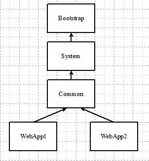

# Реализация Spring MVC своими руками
Spring Framework на данный момент времени является, наверное, самым 
популярным фреймворком в контексте Java разработки. Сегодня мы
с вами рассмотрим один из модулей данного фреймворка, а именно -
Spring MVC. Мотивацией к написанию этой статьи послужила эта
[работа](https://habr.com/ru/post/419679/) и вам лучше сначала
прочитать её, потому что часть кода мы позаимствуем оттуда. 
Собственно писать
сегодня будем таким же образом, как и в представленной
статье, то есть мы будем копировать структуру пакетов и 
названия классов оригинального спринга.
## Что получится в итоге
По окончанию статьи мы реализуем часть функциональности
аннотации `RequestMapping`, а именно, указание паттеронов и методов,
которые должен обрабатывать аннотированный метод. Для того, чтобы
сильно не раздувать статью, результат работы метода мы сразу же будем
отправлять клиенту, то есть наши контроллеры будут "рестовыми" (`RestController`).
В итоге мы получим приложение, которое при запросе ресурса `/root/greeting`
будет просто возвращать строку с приветствием пользователя. Имя пользователя
будет передаваться в качестве параметра запроса, которое мы получим
с помощью аннотации `RequestParam`.
## Предусловия
Spring MVC построен на основе Servlet API, поэтому нам нужен контейнер, 
который реализует эту спецификацию. В моем случае это будет Tomcat.
Создайте обычный Maven проект и откройте его в любимой IDE.
Теперь чтобы получить доступ к Servlet API во время компиляции нам нужно подключить его
в качестве зависимости:
```xml
 <dependency>
    <groupId>javax.servlet</groupId>
    <artifactId>javax.servlet-api</artifactId>
    <version>3.1.0</version>
    <scope>provided</scope>
</dependency>
```
Это единственная зависимость, которая нам сегодня нужна.
Если в процессе статьи у вас возникнут какие-то проблемы,
полный код вы всегда сможете найти в этом репозитоии :)
## Немного теории
Я думаю, что любой, кто когда-либо работал со Spring MVC, 
видел картинку, подобную этой:


Spring MVC построен на основе паттерна Front Controller. `DispatcherServlet` обрабатывает
любой запрос приходящий на сервер. Далее объект класса `HandlerMapping` на основе 
информации из аннотации `RequestMapping` находит метод, удовлетворяющий текущему
запросу. Потом найденный метод передается объекту `HandlerAdapter`, который
сначала с помощью объектов класса `HandlerMethodArgumentResolver` 
определяет необходимые аргументы для метода, а затем вызывает метод
с найденными аргументами. Если метод не аннотирован `ResponseBody`, то чаще
всего он возвращает строку, которая является именем шаблона. Вообще со всеми
объектами, которые может возвращать пользовательский метод можно ознакомиться
[здесь](https://docs.spring.io/spring/docs/current/spring-framework-reference/web.html#mvc-ann-return-types).
Наконец `ViewResolver` определяет нужный шаблон, и он отправляется клиенту.
## Адаптируем BeanFactory
В прошлой части уже была написана `BeanFactory`, однако в той реализации использовался
системный `ClassLoader`. Но в нашем случае данный загрузчик будет использоваться
для того, чтобы загрузить классы для работы Tomcat. Вот, посмотрите на иерархию загрузчиков
в веб-приложении:



Как видите у каждого приложения в контейнере есть свой собственный загрузчик. Как его получить, мы
разберем далее, а пока сделаем так, чтобы `BeanFactory` хранила в себе `ClassLoader` нашего приложения. 
В итоге класс `BeanFactory` в нашем случае будет выглядеть
следующим образом:
```java
public class BeanFactory {

    private ClassLoader classLoader;

    private Map<String, Object> beans = new HashMap<>();

    public BeanFactory(ClassLoader classLoader){
        this.classLoader = classLoader;
    }

    public void instantiate(String basePackage){
        try {
            String path = basePackage.replace('.', '/');
            Enumeration<URL> resources = classLoader.getResources(path);

            while (resources.hasMoreElements()) {
                URL resource = resources.nextElement();
                File file = new File(resource.toURI());
                parseFile(file, basePackage);
            }
        } catch (Exception e) {
            e.printStackTrace();
        }
    }

    private void parseFile(File baseFile, String basePackage) throws Exception {
        for(File file : baseFile.listFiles()){
            String fileName = file.getName();
            if(file.isDirectory()){
                String newBasePackage = basePackage + "." + fileName;
                parseFile(file, newBasePackage);
            }
            else if(fileName.endsWith(".class")){
                String className = fileName.substring(0, fileName.lastIndexOf("."));
                Class<?> classObject = Class.forName(basePackage + "." + className);
                parseClass(classObject);
            }
        }
    }

    private void parseClass(Class<?> classObject) throws Exception {
        if (classObject.isAnnotationPresent(Component.class) ||
                classObject.isAnnotationPresent(RestController.class)) {
            Object instance = classObject.newInstance();
            String className = classObject.getName();
            String beanName = className.substring(0, 1).toLowerCase() + className.substring(1);
            beans.put(beanName, instance);
        }
    }
}
```
В отличие от предыдущей версии я немного изменил алгоритм нахождения бинов.
В этой версии просканируются все файлы, которые находятся в базовом 
пакете и в его подпакетах. Также классы с аннотацией `RestController` 
будут считаться бинами. Чтобы компилятор не ругался на `RestController`,
создайте эту аннотацию в пакете `org.springframework.web.bind.annotation`:
```java
@Target(ElementType.TYPE)
@Retention(RetentionPolicy.RUNTIME)
public @interface RestController {
}
```
Далее в пакете`org.springframework.web.context` создадим класс `WebApplicationContext`, 
на данный момент он пока будет выглядеть так:
```java
public class WebApplicationContext {

    private BeanFactory beanFactory;

    private String basePackage;

    public WebApplicationContext(ClassLoader classLoader, String basePackage){
        beanFactory = new BeanFactory(classLoader);
        this.basePackage = basePackage;
    }
}
```
В оригинале `WebApplicationContext` является интерфейсом, который наследуется от 
интерфейса `ApplicationContext` добавляя при этом один единственный метод 
`getServletContext()`.
## Создаем обработчиков
Теперь вспомним немного про `Enum` и добавим класс `RequestMethod` в пакете
`org.springframework.web.bind.annotation`:
```java
public enum RequestMethod {

    GET("GET"), POST("POST"), PUT("PUT"), DELETE("DELETE");

    private String value;

    RequestMethod(String value){
        this.value = value;
    }

    public boolean matches(String method){
        return value.equals(method);
    }
}
```
В нашей версии мы будем использовать только 4 метода протокола HTTP. Предназначение 
метода `matches(String method)` я поясню чуть позже. Что ж, а теперь
пришло время для того, чтобы создать одну из самых основных аннотаций Spring MVC -
`RequestMapping`. Опять же в пакете `org.springframework.web.bind.annotation`
прописываем:
```java
@Retention(RetentionPolicy.RUNTIME)
@Target({ElementType.TYPE, ElementType.METHOD})
public @interface RequestMapping {

    String[] path() default "";

    RequestMethod[] methods() default {RequestMethod.GET, RequestMethod.POST,
            RequestMethod.PUT, RequestMethod.DELETE};
}
```
Реализуем только два поля аннотации `RequestMapping`. В качестве тренировки можете добавить
поддержку поля `String[] consumes()`. Если что, то все аннотации типа `GetMapping`, `PostMapping`
и т.п., просто являются более короткой записью аннотации `RequestMapping`. Далее создадим класс 
`HandlerMapping` в пакете `org.springframework.web.servlet`. Добавим ему метод `isHandler(Class<?> beanType)`,
который будет выглядеть следующим образом:
```java
public boolean isHandler(Class<?> beanType){
        return beanType.isAnnotationPresent(RestController.class)
                || beanType.isAnnotationPresent(RequestMapping.class);
    }
```
Тело метода я почти скопировал из его оригинальной реализации, там только
проверяется аннотация `Controller` вместо `RestController`. В некоторых статьях
я встречал фразу, что можно заменить аннотацию `Controller` на аннотацию
`Component` и все будет работать корректно. На самом деле это не совсем верно.
Смотря на тело метода можно понять, что если над контроллером поставить
аннотацию `Component`, но не поставить аннотацию `RequestMapping`, ваши методы не будут
обрабатывать приходящие запросы. Далее создадим следующие два класса. 
Один из них будет содержать в себе информацию, которую мы извлечем из аннотации `RequestMapping`. 
Называться он будет соответственным образом -`RequestMappingInfo`, будет располагаться 
в пакете `org.springframework.web.servlet.mvc.method`:
```java
public class RequestMappingInfo {

    private Set<String> patterns;

    private Set<RequestMethod> methods;

    public RequestMappingInfo(String[] patterns, RequestMethod[] methods) {
        this.patterns = Arrays.stream(patterns).collect(Collectors.toSet());
        this.methods = Arrays.stream(methods).collect(Collectors.toSet());
    }
}
```
Пока выглядит вот так, потом мы еще добавим несколько методов. Вторым классом будет являться
`HandlerMethod` из пакета `org.springframework.web.method`:
```java
public class HandlerMethod {

    private Method method;

    private Object bean;

    private Parameter[] methodParameters;

    public HandlerMethod(Method method, Object bean) {
        this.method = method;
        this.bean = bean;
        methodParameters = method.getParameters();
    }
}
```
То есть данный класс содержит в себе ссылку на метод обработчик, а также на контроллер, в котором этот
метод располагается. Также в поля класса сохраним параметры метода, потом они нам пригодятся.
Наконец добавим метод в класс `HandlerMapping`, который будет находить в контроллере все методы, 
аннотированные `RequestMapping`:
```java
public void detectHandlerMethods(Object handler){
        Class<?> beanType = handler.getClass();
        RequestMapping beanRequestMapping = beanType.getAnnotation(RequestMapping.class);
        RequestMappingInfo beanInfo = null;
        if(beanRequestMapping != null){
            beanInfo = new RequestMappingInfo(beanRequestMapping.path(), beanRequestMapping.methods());
        }

        for(Method method : beanType.getDeclaredMethods()){
            RequestMapping requestMapping = method.getAnnotation(RequestMapping.class);
            if(requestMapping != null){
                RequestMappingInfo info = new RequestMappingInfo(requestMapping.path(), requestMapping.methods());

                if(beanInfo != null){
                    info = info.combine(beanInfo);
                }
                HandlerMethod handlerMethod = new HandlerMethod(method, handler);
                //mappingLookup - поле класса, обычная хеш-мапа
                mappingLookup.put(info, handlerMethod);
            }
        }
    }
```
На этом методе остановимся поподробнее. Для начала нам нужно проверить наличие аннотации `RequestMapping`
над самим контроллером и, если она присутствует, то на её основе создать объект класса `RequestMappingInfo`.
Далее с помощью метода `getDeclaredMethods()` достаем все методы данного контроллера, то есть методы того
же класса `Object` мы не получим. Есть также метод `getMethods()`, который возвращает
все `public` методы данного класса и его суперкласса. Получив все методы контроолера просто проверяем наличие
аннотации `RequestMapping` и на её основе создаем объекты класса `RequestMappingInfo`. Теперь самое интересное, 
нам нужно объединить информацию из аннотации `RequestMapping`, которая стоит над классом, с аннотацией, которая
находится над методом. Для этого добавим метод `combine(RequestMappingInfo beanInfo)` в класс 
`RequestMappingInfo`:
```java
public RequestMappingInfo combine(RequestMappingInfo beanInfo){
        Set<String> newPatterns = new HashSet<>();
        for(String beanPattern : beanInfo.patterns){
            for(String pattern : patterns)
                newPatterns.add(beanPattern + pattern);
        }
        HashSet<RequestMethod> newMethods = new HashSet<>(methods);
        newMethods.addAll(beanInfo.methods);
        return new RequestMappingInfo(newPatterns, newMethods);
    }
```
Во-первых, нам нужно к паттернам URI, которые обрабатывает метод, 
добавить в качестве префикса паттерны URI контроллера. Для этого воспользуемся обычной конкатенацией строк.
Во-вторых, нам нужно объединить RequestMethod-ы контроллера и самого метода обработчика. 
На основе полученных данных возвращаем новый объект. Возвращаясь к методу `detectHandlerMethods(Object handler)`,
после получения нового объекта `RequestMappingInfo` создаем объект класса `HandlerMethod` и сохраняем эти 
два объекта в мапу, где ключом выступает `RequestMappingInfo`.
## Поиск методов обработчиков
Теперь давайте добавим в класс `RequestMappingInfo` метод, который будет проверять, удовлетворяет ли данный объект
переданному запросу:
```java
public boolean matches(String path, HttpServletRequest request) {
        String method = request.getMethod();
        if(methods.stream().noneMatch(s -> s.matches(method)))
            return false;

        return patterns.stream().anyMatch(path::matches);
    }
```
Сначала мы проверяем метод запроса, как раз здесь нам и понадобился метод `matches(String method)`
класса `RequestMethod`, так как метод `getMethod()` возвращает название метода запроса заглавными 
буквами. Также в качестве параметра будем принимать путь запрашиваемого ресурса относительно 
нашего приложения. Далее мы проверяем удовлетворяет хотя бы один паттерн из множества `patterns`
данному запросу. Пусть в нашем приложении паттерны можно будет задавать в качестве регулярных выражений.
Поэтому будем использовать стандартный метод `matches(String regex)` класса `String`. По хорошему
нужно создавать объекты класса `Pattern` во время
старта приложения для каждого объекта из множества `patterns`, а "скомпилированные" паттерны сохранять в поле 
класса. Данное решение обладает двумя плюсами. Во-первых, мы сможем проверить валидность паттерна во время старта
приложения, а не во время обработки запроса. При невалидном регулярном выражении бросаем исключение, не 
давая приложению запуститься. Во-вторых, сама процедура создания объекта класса `Pattern` достаточно дорогая. Пусть
уж лучше приложение запускается дольше, но обработка самих запросов будет быстрее. В нашей реализации мы этого делать
не будем, чтобы, скажем так, вспомогательного кода было поменьше. После этого добавим в 
класс `HandlerMapping` следующий метод:
```java
private HandlerMethod lookupHandlerMethod(String path, HttpServletRequest request){
        for(RequestMappingInfo info : mappingLookup.keySet()){
            if(info.matches(path, request)){
                return mappingLookup.get(info);
            }
        }
        return null;
    }
```
То есть мы проходимся по всем ключам мапы `mappingLookup` и ищем `RequestMappingInfo`, удовлетворяющий
текущему запросу. Затем просто возвращаем `HandlerMethod` соответствующий найденному ключу. Также стоит
здесь упомянуть, что оригинальный спрниг не сразу возвращает метод обработчик. Он ищет все методы, которые
удовлетворяют этому запросу, а потом выбирает из них тот, который более уникальный. К примеру, если у нас 
есть два метода. Один из них обрабатывает запросы, приходящие на `/root/test`, а второй - `/root/*`. 
Как вы уже догадались, будет вызван именно первый метод, так как паттерн более уникальный.
Мы этого реализовывать не будем, так как это достаточно непростая задача. Наконец добавим
`public` метод, который мы будем вызывать непосредственно из класса `DispatcherServlet`:
```java
public HandlerMethod getHandler(HttpServletRequest request){
        String requestURI = request.getRequestURI();
        String lookupPath = requestURI.substring(request.getContextPath().length());
        return lookupHandlerMethod(lookupPath, request);
    }
```
Также в этом методе определим относительный путь запрашиваемого ресурса. Метод `getRequestURI()`
вернет строку вида `/web-app/test`, где `/web-app` - context path нашего приложения. 
Обычно context path-ом является название war файла приложения. То есть в итоге `lookupPath` 
будет равен `/test.`
## Вызываем метод обработчик
После того, как мы нашли метод обработчик для текущего запроса, нам нужно его вызвать. Но для того, чтобы
это сделать, нам сначала нужно найти аргументы этого метода. Этим занимаются классы, реализующие интерфейс
`HandlerMethodArgumentResolver` из пакета `org.springframework.web.method.support`. Данный интерфейс выглядит
следующим образом:
```java
public interface HandlerMethodArgumentResolver {

    boolean supports(Parameter parameter);

    Object resolveArgument(Parameter parameter, HttpServletRequest request, HttpServletResponse response);
}
```
Спринг по умолчанию имеет немалое количество "резолверов", но, если вы захотели создать свой собственный,
то реализуйте этот интерфейс, а потом в конфигурации приложения добавьте его с помощью метода 
`addArgumentResolvers(List<HandlerMethodArgumentResolver> argumentResolvers)` класса `WebMvcConfigurerAdapter`.
Для каждого типа параметра метода обработчика существует свой `HandlerMethodArgumentResolver`. Если есть желание ознакомиться
со всеми типами параметров, который может принимать ваш метод, можете заглянуть [сюда](https://docs.spring.io/spring/docs/current/spring-framework-reference/web.html#mvc-ann-arguments).
В нашей версии параметром метода может быть `HttpServletRequest` и строка, являющееся параметром запроса.
Значение строки мы достанем с помощью аннотации `RequestParam` из пакета `org.springframework.web.bind.annotation`:
```java
@Target(ElementType.PARAMETER)
@Retention(RetentionPolicy.RUNTIME)
public @interface RequestParam {

    String name();

    String defaultValue() default "null";
}
```
Как видите, в качестве "таргета" мы указали только параметр метода. Так как `null` не может являться значением по 
умолчанию, у нас будет просто строка null. По хорошему нужно создать отдельную константу для этого, что, кстати,
и делают Juergen Hoeller и компания. Далее давайте добавим класс `RequestParamMethodArgumentResolver`, 
который будет обрабатывать параметры метода с аннотацией `RequestParam`. Данный класс находится в пакете 
`org.springframework.web.method.annotation`:
```java
public class RequestParamMethodArgumentResolver implements HandlerMethodArgumentResolver {

    @Override
        public boolean supports(Parameter parameter) {
            RequestParam requestParam = parameter.getAnnotation(RequestParam.class);
            return requestParam != null;
        }
    
        @Override
        public Object resolveArgument(Parameter parameter, HttpServletRequest request, HttpServletResponse response) {
            RequestParam requestParam = parameter.getAnnotation(RequestParam.class);
            String arg = request.getParameter(requestParam.name());
            return arg != null ? arg : requestParam.defaultValue();
        }
}
```
Я думаю, что здесь все понятно. Также добавим "резолвера" для объекта запроса, он будет находится в том же пакете
`org.springframework.web.method.annotation` и будем называться соответственным образом - `HttpRequestMethodArgumentResolver`:
```java
public class HttpRequestMethodArgumentResolver implements HandlerMethodArgumentResolver {

    @Override
    public boolean supports(Parameter parameter) {
        return HttpServletRequest.class.isAssignableFrom(parameter.getType());
    }

    @Override
    public Object resolveArgument(Parameter parameter, HttpServletRequest request, HttpServletResponse response) {
        return request;
    }
}
```
Данный класс получился еще проще предыдущего. Метод `isAssignableFrom(Class<?> clazz)` проверяет
является ли класс `HttpServletRequest` суперинтерфейсом для класса параметра. Теперь пусть класс 
`HandlerMethod` будет содержать в себе следующий метод:
```java
private Object[] getMethodArgumentValues(HttpServletRequest request, HttpServletResponse response){
        if(methodParameters.length == 0)
            return new Object[0];

        Object[] args = new Object[methodParameters.length];
        for(int i = 0; i < args.length; i++){
            Parameter parameter = methodParameters[i];
            for(HandlerMethodArgumentResolver argumentResolver : resolvers){
                if(argumentResolver.supports(parameter)){
                    args[i] = argumentResolver.resolveArgument(parameter, request, response);
                    break;
                }
            }
        }
        return args;
    }
``` 
Как понятно из названия, данный метод непосредственно будет определять аргументы для метода обработчика.
Если помните, то массив `methodParameters` мы заполнили ещё в конструкторе. `resolvers` - это обычный лист, который
мы присвоим с помощью сетера. Наконец добавим публичный метод для вызова обработчика:
```java
public Object invokeAndHandle(HttpServletRequest request, HttpServletResponse response){
        Object[] args = getMethodArgumentValues(request, response);
        Object result = null;
        try {
            result = method.invoke(bean, args);
        } catch (Exception e) {
            e.printStackTrace();
        }
        return result;
    }
```
Ничего сложного, сначала определяем аргументы метода, далее вызываем его и возвращаем результат
работы. Сам `DispatcherServlet` не будет вызывать метод обработчик, этим займется класс `HandlerAdapter`
из пакета `org.springframework.web.servlet.mvc.method.annotation`:
```java
public class HandlerAdapter {

    private List<HandlerMethodArgumentResolver> argumentResolvers;

    public HandlerAdapter(List<HandlerMethodArgumentResolver> argumentResolvers) {
        this.argumentResolvers = argumentResolvers;
    }

    public void invokeHandlerMethod(HttpServletRequest request,
                                        HttpServletResponse response, HandlerMethod handlerMethod) throws IOException {
            handlerMethod.setResolvers(argumentResolvers);
            Object result = handlerMethod.invokeAndHandle(request, response);
            response.getWriter().println(result);
        }
}
```
В методе `invokeHandlerMethod` мы запускаем метод обработчик и сразу отправляем результат клиенту. 
Также, как вы могли заметить, данный класс будет хранить в себе все "резолверы".
## Создаем DispatcherServlet
Что ж, пришло время создать точку входа в наше приложение. Добавьте класс `DispatcherServlet` в пакет 
`org.springframework.web.servlet`:
```java
public class DispatcherServlet extends HttpServlet {

    private WebApplicationContext webApplicationContext;

    private HandlerMapping handlerMapping;

    private HandlerAdapter handlerAdapter;

    public DispatcherServlet(WebApplicationContext context){
        webApplicationContext = context;
    }

    private void doDispatch(HttpServletRequest request, HttpServletResponse response) throws IOException {
        HandlerMethod handler = handlerMapping.getHandler(request);
        if(handler == null)
            response.sendError(HttpServletResponse.SC_NOT_FOUND);
        else
            handlerAdapter.invokeHandlerMethod(request, response, handler);
    }

    @Override
    protected void doGet(HttpServletRequest req, HttpServletResponse resp) throws IOException {
        doDispatch(req, resp);
    }
}
```
Как видите, методы типа `doX` будут просто делегировать запрос методу `doDispatch`. Этот метод сначала
будет искать метод обработчик, который удовлетворяет текущему запросу. Если не удалось найти такой метод, то
просто будем возвращать клиенту 404. Если же метод найден, то вызываем его с помощью `handlerAdapter`.
## Инициализация
Мы добавили поля `handlerMapping` и `handlerAdapter`, но не инициализировали их, пришло время сделать это.
В класс `WebApplicationContext` нужно добавить следующие методы. Во-первых метод для инициализации `HandlerMapping`:
```java
public HandlerMapping initHandlerMapping(){
        HandlerMapping handlerMapping = new HandlerMapping();
        for (Object bean : beanFactory.getBeans().values()) {
            Class<?> beanType = bean.getClass();
            if(handlerMapping.isHandler(beanType))
                handlerMapping.detectHandlerMethods(bean);
        }
        return handlerMapping;
    }
```
То есть мы проверяем является ли бин контроллером, если является, то пытаемся найти в нем все методы
обработчики. Во-вторых добавим метод для создания `HandlerAdapter`:
```java
public HandlerAdapter initHandlerAdapter(){
        return new HandlerAdapter(initArgumentResolvers());
    }

    private List<HandlerMethodArgumentResolver> initArgumentResolvers(){
        List<HandlerMethodArgumentResolver> resolvers = new ArrayList<>();
        resolvers.add(new RequestParamMethodArgumentResolver());
        resolvers.add(new HttpRequestMethodArgumentResolver());

        return resolvers;
    }
```
Сначала создаем всех доступных "резолверов", а потом на их основе создаем `HandlerAdapter`.
Не забудем и инициализировать саму фабрику:
```java
public void init(){
        beanFactory.instantiate(basePackage);
    }
```
А теперь осталось все эти методы вызвать в `DispatcherServlet`:
```java
@Override
public void init() {
        webApplicationContext.init();
        handlerMapping = webApplicationContext.initHandlerMapping();
        handlerAdapter = webApplicationContext.initHandlerAdapter();
    }
```
Данный метод будет вызван контейнером при старте приложения и произведёт всю нужную нам инициализацию.
## Старт приложения
До того, как появилась 3 версия Servlet API, регистрацию DispatcherServlet-a
осуществляли только с помощью `web.xml`, но в 3 версии добавили возможность регистрации
через Java код. В нашей реализации мы будем производить регистрацию именно с помощью кода.
Создадим класс `WebApplicationInitializer` в пакете `org.springframework.web`:
```java
 public abstract class WebApplicationInitializer {
 
     public void onStartup(ServletContext context) {
         WebApplicationContext applicationContext =
                 new WebApplicationContext(context.getClassLoader(), getPackageToScan());
         DispatcherServlet dispatcherServlet = new DispatcherServlet(applicationContext);
 
         ServletRegistration.Dynamic registration =
                 context.addServlet("dispatcherServlet", dispatcherServlet);
         registration.setLoadOnStartup(1);
         registration.addMapping(getServletMapping());
     }
 
     protected abstract String getServletMapping();
 
     protected abstract String getPackageToScan();
 }
```
Сделаем два абстрактных метода, чтобы клиент мог указать мапинг для DispatcherServlet-a и пакет, 
в котором находятся пользовательские классы. Если помните еще при создании фабрики был вопрос, откуда 
нам взять `ClassLoader`? Как раз с помощью `ServletContext` мы это и сделаем. Также укажем диспатчер
сервлету, чтобы его инициализация происходила во время старта приложения.  

В реальном веб-приложении может возникнуть нужда в создании еще одного DispatcherServlet-a, но с другой
конфигурацией, то есть получается, что у них должен быть разный `WebApplicationContext`. Но также помимо
контроллеров, "резолверов" аргументов и т.п., в приложении должны быть бины, отвечающие за его бизнес-логику.
Было бы странно, если бы один бин существовал в двух экземплярах. Во избежание этой проблемы при старте 
приложения, спринг создает два контекста. Один, так называемый, `RootContext`, где хранятся 
бины отвечающие за логику приложения. А второй `WebContext`, где хранятся бины для обработки  
запросов. `RootContext` является родителем `WebContext`, поэтому дублирования бинов не происходит.
Также `RootContext` нужен для того, чтобы связать жизненный цикл спринг приложения, с жизненным циклом
ServletContext-а. Например, при завершении работы приложения, контейнер вызывает метод 
`contextDestroyed(ServletContextEvent event)` всех слушателей, которые реализуют интерфейс 
`ServletContextListener`. Как раз в этом методе и должен "закрываться" контекст спринг приложения.
В нашей реализации мы оставим один контекст, так как у нас простой случай и один `DispatcherServlet`. 

Вернемся к нашей инициализации. Возникает вопрос, а как сделать так, чтобы 
контейнер при старте приложения вызвал наш метод `onStartup(ServletContext context)`? После прочтения предыдущего абзаца, 
первая мысль, которая может возникнуть, это использовать `ServletContextListener` и в методе `contextInitialized(ServletContextEvent event)` 
производить всю инициализацию. Но в спринге не используется данный подход, как минимум, из-за одного недостатков. 
Так как в оригинальном спринге `RootContext` создается именно с помощью слушателя `ContextLoaderListener`,
нужно чтобы он отрабатывал раньше всех слушателей, которые может добавить клиент. Поэтому при старте 
приложения спринг добавляет своего слушателя, а слушатели, которые реализуют интерфейс `ServletContextListener` будут 
запускаться в том порядке, в котором они были добавлены. Так как метод `onStartup(Set<Class<?>> classes, ServletContext context)` (см. ниже) 
отработает раньше всех слушателей, контекст будет уже создан к началу работы слушателей клиента. Также порядок запуска 
слушателей можно указать в `web.xml`, но мы же не хотим заставлять клиента использовать xml.

Как и в оригинальном спринге мы будем использовать механизм SPI, который стал доступен начиная с 3 версии Servlet API.
Подробнее про SPI можно прочесть [здесь](https://www.baeldung.com/java-spi)(английский) 
и [здесь](https://habr.com/ru/post/118488/)(русский). Во-первых создадим класс, который будет реализовывать 
интерфейс `ServletContainerInitializer`. В пакет `org.springframework.web` добавим класс `SpringServletContainerInitializer`:
```java
@HandlesTypes(WebApplicationInitializer.class)
public class SpringServletContainerInitializer implements ServletContainerInitializer {

    @Override
    public void onStartup(Set<Class<?>> classes, ServletContext context) {
        if (classes != null) {
            for(Class<?> clazz : classes){
                try {
                    WebApplicationInitializer initializer =
                            (WebApplicationInitializer) clazz.newInstance();
                    initializer.onStartup(context);
                } catch (Exception e) {
                    e.printStackTrace();
                }
            }
        }
    }
}
```
Самое интересное для нас здесь - аннотация `HandlesTypes`. Во время старта приложения контейнер будет 
искать в war файле все классы, которые реализуют абстрактный класс `WebApplicationInitializer`, все найденные
классы он передаст в качестве множества `classes`. Дальше мы уже сами руками вызываем метод 
`onStartup(ServletContext context)`. Наконец создаем файл с названием `javax.servlet.ServletContainerInitializer`
в директории `resources/META-INF/services/`. В нем прописываем полное имя класса, который реализует интерфейс
`ServletContainerInitializer`. В нашем случае это будет `org.springframework.web.SpringServletContainerInitializer`.
## Пишем клиента
Что ж, настало время проверить, что мы написали. Создайте пакет `com.client`, а в нем класс 
`AppInitializer`:
```java
public class AppInitializer extends WebApplicationInitializer {

    @Override
    protected String getServletMapping() {
        return "/";
    }

    @Override
    protected String getPackageToScan() {
        return "com.client";
    }
}
```
Далее осталось только добавить контроллер. В пакете `com.client.controller` создадим класс 
`GreetingController`:
```java
@RestController
@RequestMapping(path = "/root", methods = RequestMethod.POST)
public class GreetingController {

    @RequestMapping(path = "/greeting", methods = RequestMethod.GET)
    public String test(HttpServletRequest request,
                       @RequestParam(name = "name", defaultValue = "user") String name){
        String requestName = Optional.ofNullable(request.getParameter("name")).
                orElse("user");
        if(!name.equals(requestName))
            throw new IllegalArgumentException();
        return "Hello " + name;
    }
}
```
## Тестируем
Поехали! Запускаем сервер, начинаем тестировать. Сначала отправим `GET` и `POST` запросы 
на ресурс `/root/greeting?name=Nick`:


Теперь попробуем отправить `PUT` запрос на тот же адрес:


Все как и ожидалось. Сервер нам вернул 404, так как мы обрабатываем только `GET` и `POST` методы. 
Наконец отправим `GET` запрос без параметра:


Работает корректно. В принципе, вы еще можете поиграться, к примеру, потестировать регулярные выражения 
или указать несколько паттернов для одного метода. А я, пожалуй, на этом закончу. Надеюсь, что статья
оказалась для вас полезной, и вы открыли для себя что-то новое.